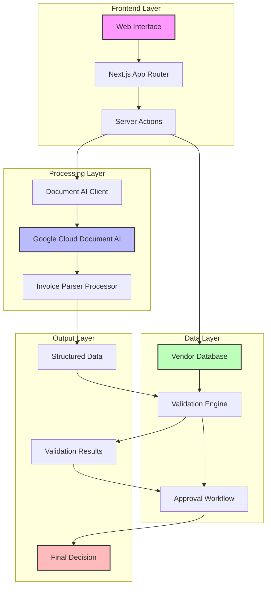

# Invoice Processing Application

A modern web application for automated invoice processing, validation, and approval workflows. Built with Next.js, Google Document AI, and Tailwind CSS.


## Features

- 📄 Automated invoice data extraction
- ✅ Real-time validation against vendor database
- 📊 Dynamic vendor history and analytics
- 🔄 Approval workflow with edit capabilities
- 📱 Responsive design for all devices
- 🎯 Progress tracking for processing stages

## Architecture

The application follows a modern, serverless architecture leveraging Next.js App Router and Google Cloud services.



### Component Description

1. **Frontend Layer**
   - Web Interface: React-based UI with Tailwind CSS and shadcn/ui
   - Next.js App Router: Handles routing and server-side operations
   - Server Actions: Processes form submissions and API calls

2. **Processing Layer**
   - Document AI Client: Interfaces with Google Cloud
   - Google Cloud Document AI: Main processing engine
   - Invoice Parser: Specialized processor for invoice extraction

3. **Data Layer**
   - Vendor Database: Stores vendor profiles and history
   - Validation Engine: Compares extracted data with records
   - Approval Workflow: Manages the review process

4. **Output Layer**
   - Structured Data: Normalized invoice information
   - Validation Results: Comparison outcomes
   - Final Decision: Approval status and actions

## Tech Stack

- Next.js 14 (App Router)
- Google Cloud Document AI
- Tailwind CSS
- TypeScript
- Shadcn/ui Components

## Getting Started

### Prerequisites

- Node.js 18+ installed
- Google Cloud account with Document AI API enabled
- Google Cloud credentials

### Installation

1. Clone the repository:
```bash
git clone https://github.com/yourusername/invoice-processor.git
cd invoice-processor
```

2. Install dependencies:
```bash
npm install
# or
yarn install
```

3. Create a `.env.local` file in the root directory with your Google Cloud credentials:
```env
GOOGLE_PROJECT_ID=your-project-id
GOOGLE_LOCATION=your-location
GOOGLE_PROCESSOR_ID=your-processor-id
GOOGLE_CLIENT_EMAIL=your-client-email
GOOGLE_PRIVATE_KEY=your-private-key
```

4. Start the development server:
```bash
npm run dev
# or
yarn dev
```

5. Open [http://localhost:3000](http://localhost:3000) in your browser.

### Setting up Google Cloud Document AI

1. Go to [Google Cloud Console](https://console.cloud.google.com)
2. Enable Document AI API
3. Create a new processor (Invoice Parser)
4. Create a service account and download credentials
5. Add credentials to your `.env.local` file

## Usage

1. Upload an invoice (PDF or image)
2. Wait for automatic processing
3. Review extracted data and validation results
4. Approve, deny, or request changes
5. View vendor history and analytics

## Demo Data

The application includes mock vendor data for demonstration purposes. In a production environment, you would connect this to your actual vendor database.

## Contributing

1. Fork the repository
2. Create your feature branch (`git checkout -b feature/AmazingFeature`)
3. Commit your changes (`git commit -m 'Add some AmazingFeature'`)
4. Push to the branch (`git push origin feature/AmazingFeature`)
5. Open a Pull Request

## License

This project is licensed under the MIT License - see the [LICENSE](LICENSE) file for details.

## Acknowledgments

- Built with [Next.js](https://nextjs.org/)
- Styled with [Tailwind CSS](https://tailwindcss.com/)
- UI Components from [shadcn/ui](https://ui.shadcn.com/)
- Document processing by [Google Document AI](https://cloud.google.com/document-ai)

## Deployment

### Deploy to Vercel

The easiest way to deploy this application is to use the Vercel Platform.

1. Fork this repository
2. Create a Vercel account at https://vercel.com
3. Create a new project and import your forked repository
4. Add your environment variables in the Vercel project settings
5. Deploy!

[](https://vercel.com/new/clone?repository-url=https://github.com/yourusername/invoice-processor)

### Other Deployment Options

You can also deploy this application to:
- AWS Amplify
- Netlify
- Docker container
- Traditional hosting

See the [deployment documentation](docs/deployment.md) for detailed instructions. 